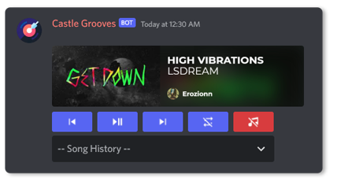

# Castle Grooves

#### A modern self-hosted alternative to the late Groovy Bot.

  



## Features

- Intuitive Slash Commands
- Sleek Song Interface
- Unlimited Song Queue
- Music Player Discord Buttons
- Music History Menu
- Experimental Vosk voice commands for song requests
- InfluxDB support for song history and top played songs
- _And More!_

### Commands

| Name                |                Description                 |                         Options |
| :------------------ | :----------------------------------------: | ------------------------------: |
| **/pause**          |           Pause the current song           |                                 |
| **/play**           |          Play a song from youtube          |                        \<query> |
| **/play-next**      |     Add a song to the top of the queue     |                        \<query> |
| **/resume**         |          Resume the current song           |                                 |
| **/shuffle**        |             Shuffle the queue              |                                 |
| **/skip**           |          Skip to the current song          |                                 |
| **/top-songs list** |     Lists top songs for server or user     | \<number> \<time-range> \<user> |
| **/top-songs play** |     Plays top songs for server or user     | \<number> \<time-range> \<user> |
| **/voice enable**   | Start experimental voice command listening |                                 |
| **/voice disable**  | Stop experimental voice command listening  |                                 |
| **/voice status**   |    Show voice command listening status     |                                 |

## Install

### Manually

1. Install FFMPEG and InfluxDB.
2. Clone the repository: `git clone https://github.com/Erozionn/castle-grooves`.
3. `cd castle-grooves`.
4. Install dependencies with `yarn install`.
5. Copy `.env.example` to `.env` and fill it.
6. Run `yarn build` and `yarn start:prod`, or use `yarn dev` for local TypeScript development.

### Docker Compose

1. Copy `.env.example` to `.env.dev` for local development or `.env` for production.
2. Fill the Discord, Spotify, Lavalink, and InfluxDB values.
3. Start the local stack:

```bash
yarn docker:dev
```

Production uses the published Docker Hub image and Watchtower auto-updates:

```bash
yarn docker:prod
```

See `DOCKER.md` for local Docker details and `DEPLOYMENT.md` for the production server flow.

### Build Docker Image

Build the production image locally with:

```bash
yarn docker:build
```

## Experimental Voice Commands

Voice commands are disabled by default. Set `VOICE_COMMANDS_ENABLED=true`, join a Discord voice channel, then run `/voice enable`. For Lavalink setups, set `VOICE_LISTENER_BOT_TOKEN` to a second Discord bot token and invite that listener bot to the same server so audio receive does not fight the music bot voice connection. The v1 grammar is strict: say `castle grooves play <song query>` and the bot will immediately queue the best match using the same search and queue path as `/play`.

Vosk model files are not committed to this repository. Download an English small Vosk model and place or mount it at `./models/vosk-model-small-en-us`, or set `VOSK_MODEL_PATH` to another Vosk-compatible model directory. The Docker image uses Debian `node:lts-slim` with native build/runtime packages for Vosk plus ffmpeg.

## Environment Variables

- `CLIENT_ID` is the ID of your Discord Bot
- `GUILD_ID` is the ID of your Discord Server
- `BOT_TOKEN` is the token of your Discord BOT
- `ADMIN_USER_ID` is the ID of your Discord Account
- `DEFAULT_TEXT_CHANNEL` is the ID of your Discord Server's Default Text Channel
- `SPOTIFY_CLIENT_ID` / `SPOTIFY_CLIENT_SECRET` are your Spotify API credentials
- `INFLUX_URL` is the URL to your InfluxDB
- `INFLUX_BUCKET` is your InfluxDB bucket name
- `INFLUX_ORG` is your InfluxDB Organization name
- `INFLUX_TOKEN` is your InfluxDB Access Token
- `WEBSERVER_PORT` is the port for the integrated API
- `DOCKER_HUB_USERNAME` is required for production Docker Compose pulls
- `VOICE_COMMANDS_ENABLED` enables the experimental `/voice` commands when set to `true`
- `VOICE_LISTENER_BOT_TOKEN` optionally runs voice receive through a second Discord bot, recommended with Lavalink
- `VOSK_MODEL_PATH` points to the local Vosk model directory
- `VOICE_WAKE_PHRASE` defaults to `castle grooves`
- `VOICE_COMMAND_PREFIX` defaults to `play`
- `VOICE_CAPTURE_TIMEOUT_MS` limits each speech capture window
- `VOICE_SILENCE_MS` controls how long silence ends a speech capture
