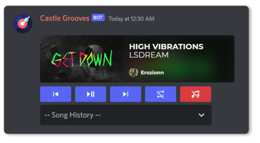

# Castle Grooves

#### A modern self-hosted alternative to the late Groovy Bot.

  



## Features

- Intuitive Slash Commands
- Sleek Song Interface
- Unlimited Song Queue
- Music Player Discord Buttons
- Music History Menu
- Experimental Vosk voice commands for song requests
- InfluxDB support for song history and top played songs
- _And More!_

### Commands

| Name                |                Description                 |                         Options |
| :------------------ | :----------------------------------------: | ------------------------------: |
| **/pause**          |           Pause the current song           |                                 |
| **/play**           |          Play a song from youtube          |                        \<query> |
| **/play-next**      |     Add a song to the top of the queue     |                        \<query> |
| **/resume**         |          Resume the current song           |                                 |
| **/shuffle**        |             Shuffle the queue              |                                 |
| **/skip**           |          Skip to the current song          |                                 |
| **/top-songs list** |     Lists top songs for server or user     | \<number> \<time-range> \<user> |
| **/top-songs play** |     Plays top songs for server or user     | \<number> \<time-range> \<user> |
| **/voice**          |    Show voice command listening status     |                                 |

## Install

### Manually

1. Install FFMPEG and InfluxDB.
2. Clone the repository: `git clone https://github.com/Erozionn/castle-grooves`.
3. `cd castle-grooves`.
4. Install dependencies with `yarn install`.
5. Copy `.env.example` to `.env` and fill it.
6. Run `yarn build` and `yarn start:prod`, or use `yarn dev` for local TypeScript development.

### Docker Compose

1. Copy `.env.example` to `.env.dev` for local development or `.env` for production.
2. Fill the Discord, Spotify, Lavalink, and InfluxDB values.
3. Start the local stack:

```bash
yarn docker:dev
```

Production uses the published Docker Hub image and Watchtower auto-updates:

```bash
yarn docker:prod
```

See `DOCKER.md` for local Docker details and `DEPLOYMENT.md` for the production server flow.

### Build Docker Image

Build the production image locally with:

```bash
yarn docker:build
```

## Experimental Voice Commands

Voice commands are disabled by default. Set `VOICE_COMMANDS_ENABLED=true`, join a Discord voice channel, then use the `Voice: Off` button beside the thumbs-down button to toggle listening. For Lavalink setups, set `VOICE_LISTENER_BOT_TOKEN` to a second Discord bot token and invite that listener bot to the same server so audio receive does not fight the music bot voice connection. Say `castle grooves add <song query>` to queue music, or say `castle grooves pause`, `castle grooves skip`, or `castle grooves stop` to control playback. `play <song query>` remains supported as an alias for `add`.

Hello replies are an opt-in joke feature. Set `VOICE_HELLO_RESPONSES_ENABLED=true` to respond to a standalone `hello` with a random sound (15-second per-user cooldown). Docker deployments download and persist the ignored `assets/audio/hello-responses/` files automatically; non-Docker setups can run `yarn download:hello-sounds`. Use only sounds you are permitted to download and use.

Vosk model files are not committed to this repository. Download an English small Vosk model and place or mount it at `./models/vosk-model-small-en-us`, or set `VOSK_MODEL_PATH` to another Vosk-compatible model directory. The Docker image uses Debian `node:lts-slim` with native build/runtime packages for Vosk plus ffmpeg.

## Environment Variables

- `CLIENT_ID` is the ID of your Discord Bot
- `GUILD_ID` is the ID of your Discord Server
- `BOT_TOKEN` is the token of your Discord BOT
- `ADMIN_USER_ID` is the ID of your Discord Account
- `DEFAULT_TEXT_CHANNEL` is the ID of your Discord Server's Default Text Channel
- `SPOTIFY_CLIENT_ID` / `SPOTIFY_CLIENT_SECRET` are your Spotify API credentials
- `INFLUX_URL` is the URL to your InfluxDB
- `INFLUX_BUCKET` is your InfluxDB bucket name
- `INFLUX_ORG` is your InfluxDB Organization name
- `INFLUX_TOKEN` is your InfluxDB Access Token
- `WEBSERVER_PORT` is the port for the integrated API
- `DASHBOARD_PUBLIC_URL` is the HTTPS same-origin URL for the React dashboard
- `DISCORD_OAUTH_CLIENT_ID`, `DISCORD_OAUTH_CLIENT_SECRET`, and `DISCORD_OAUTH_REDIRECT_URI` configure Discord `identify` login
- `DASHBOARD_SESSION_SECRET` signs encrypted HTTP-only dashboard sessions
- `DASHBOARD_ADMIN_DISCORD_USER_IDS`, `DASHBOARD_DJ_DISCORD_USER_IDS`, and `DASHBOARD_VIEWER_DISCORD_USER_IDS` are comma-separated dashboard allowlists (admin > DJ > viewer)
- `DOCKER_HUB_USERNAME` is required for production Docker Compose pulls
- `VOICE_COMMANDS_ENABLED` enables the experimental voice toggle when set to `true`
- `VOICE_HELLO_RESPONSES_ENABLED` enables the opt-in standalone `hello` sound replies (defaults to `false`)
- `VOICE_WAKE_WORD_CONFIRM_SOUND_ENABLED` plays the wake-word confirmation sound when set to `true` (defaults to `false`)
- `VOICE_LISTENER_BOT_TOKEN` optionally runs voice receive through a second Discord bot, recommended with Lavalink
- `VOSK_MODEL_PATH` points to the local Vosk model directory
- `VOICE_WAKE_PHRASE` defaults to `castle grooves`
- `VOICE_CAPTURE_TIMEOUT_MS` limits each speech capture window
- `VOICE_SILENCE_MS` controls how long silence ends a speech capture

## Dashboard backend API

The React dashboard is a separate repository. This bot serves its authenticated
backend at `/api/v1`, Discord login routes at `/auth`, and a standard WebSocket
at `/ws`, behind the same HTTPS reverse-proxy origin as the UI. Versioned REST
and WebSocket contracts live in `contracts/openapi.yaml` and
`contracts/asyncapi.yaml`. Legacy `/play` links remain supported for existing
Influx/Grafana replay links and use `ADMIN_USER_ID` only as the playback
identity.

Dashboard DJs can choose a voice channel without joining it. The UI obtains
channels from `GET /api/v1/voice-channels` and sends `voiceChannelId` with song
adds and history replay requests. Omitting it selects Auto: the DJ's voice
channel, or the active bot channel when the DJ is not in voice. An explicit
choice can move the single active queue to that channel and keeps it playing
when the room is empty. The bot needs Connect and Speak permissions there.
